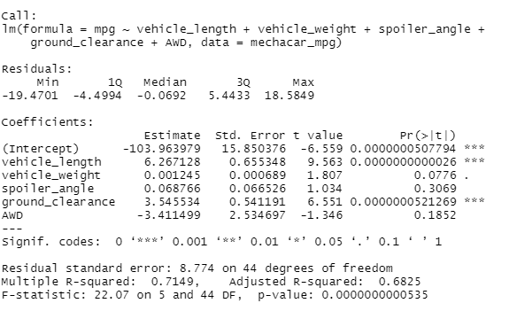
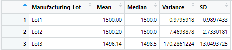
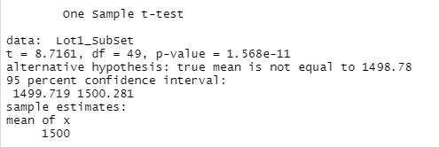
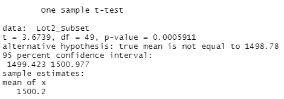
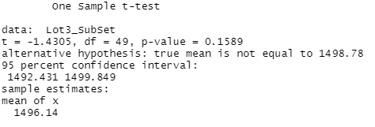

# MechaCar_Statistical_Analysis

## Linear Regression to Predict MPG

#### Significant Variables

In this model we looked at the relationship between different vehicle variables and the vehicle's MPG. Out of the 5 variables analyzed, the only two that were significant were vehicle length and ground clearance. This was determined by the Pr(>|t|) value in the analysis above, which were very low for vehicle length and ground clearance.

#### Slope of Model

The slope of this model is not considered to be zero because the p-value is low enough to reject the null hypothesis as it proves enough evidence for even a 99% confidence level.

#### Is this Model Effective?

This model has an R-squared value of  0.7149 which means that roughly 71% of the MPG data can be explained by our model. This means the model is pretty accurate, but could be improved.

## Summary Statistics on Suspension Coils

#### Total Summary

#### Lot Summary

After evaluating the suspension coil PSI both and total and by lot, shown above. When looking at a total summary, you can see that accross all lots the PSI variance stays below the 100 PPI requirement. Although, when separating the dat by lot it seems that there is a very large variance coming from lot 3, and this does draw some concern as it is above the design specifications for MechaCar.

## T-Tests on Suspension Coils

#### Lot 1 T-Test Results

#### Lot 2 T-Test Results

#### Lot 3 T-Test Results

From these 3 T-Tests shown above, you can see the p value comparing the mean of the lot subsets and the mean of the entire population. In the T-Tests for lots 1 and 2, you can see that the p-value is considerably lower than our 95% confidence level needs to be able to reject the null hypothesis and accept the alternate for each. Although, in lot 3 the p value is much higher at 0.15, so for this subset we are not able to reject the null hypothesis and would state that the two means are statistically similar.

## Study Design: MechaCar vs Competition

This proposed study would test the relationship between a vehicle's highway fuel efficiency and it's horsepower. The null hypothesis in this study would be that an increase in horsepower does not cause a statistical difference in highway fuel efficiency, and the alternative hypothesis would be that it does. The statistical test I intend to use would be a simple linear regression analysis to see the strength of relationship between horsepower as the independent variable and highway fuel efficiency as the dependent variable. The data needed to run this test would be the performance metrics of a certain type of Mechacar vehicle, sedan, as well as the performance metrics for some of the competitions cars to then compare how the relationship of MechaCar's vehicles' horsepower and highway MPG stacks up against the competition. 